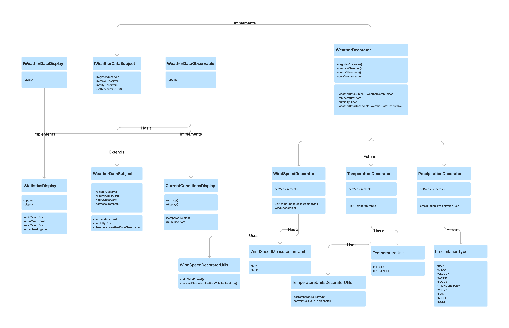

# WeatherDataSubject
## Description
This is a weather data subject class that implements the `IWeatherDataSubject` interface. It is responsible for storing the weather data and notifying the observers when the weather data changes.

## Properties
* temperature: `float`
* humidity: `float`
* observers: `List<WeatherDataObservable>`

## Methods
* `void registerObserver(WeatherDataObservable observer)`: Registers an observer to the subject.
* `void removeObserver(WeatherDataObservable observer)`: Removes an observer from the subject.
* `void notifyObservers()`: Notifies all the observers that the weather data has changed.
* `void setMeasurements(float temperature, float humidity)`: Sets the weather data and notifies the observers.

# CurrentConditionsDisplay
## Description
This is a current conditions display class that implements both `WeatherDataObservable` and `IWeatherDataDisplay` interfaces. It is responsible for displaying the current weather data.

## Properties
* temperature: `float`
* humidity: `float`

## Methods
* `void update(float temperature, float humidity)`: Updates the weather data and displays it.
* `void display()`: Displays the current weather data.

# StatisticsDisplay
## Description
This is a statistics display class that implements both `WeatherDataObservable` and `IWeatherDataDisplay` interfaces. It is responsible for displaying the statistics of the weather data.

## Properties
* temperature: `float`
* humidity: `float`

## Methods
* `void update(float temperature, float humidity)`: Updates the weather data and displays it.
* `void display()`: Displays the statistics of the weather data.

# Interfaces
## IWeatherDataDisplay
This interface is responsible for displaying - by using `display()` - the weather data.

## IWeatherDataSubject
This interface is responsible for registering, removing and notifying the observers.

## WeatherDataObservable
This interface is responsible for updating the weather data.

# Enums
## WindSpeedMeasurementUnit
This enum is used by `WindSpeedDecorator`, and it's responsible for storing the wind speed measurement units.

* `MPH`: Miles per hour
* `KPH`: Kilometers per hour

## TemperatureUnit
This enum is used by `TemperatureUnitsDecorator`, and it's responsible for storing the temperature units.

* `CELSIUS`: Celsius
* `FAHRENHEIT`: Fahrenheit

## PrecipitationType
This enum is used by `PrecipitationDecorator`, and it's responsible for storing the precipitation types.
* `RAIN`: "Rain"
* `SNOW`: "Snow"
* `CLOUDY`: "Cloudy"
* `SUNNY`: "Sunny"
* `FOGGY`: "Foggy"
* `THUNDERSTORM`: "Thunderstorm"
* `WINDY`: "Windy"
* `HAIL`: "Hail"
* `SLEET`: "Sleet"
* `NONE`: "None"

# Weather Decorators
## WeatherDecorator
This is an abstract class that implements the `WeatherDataObservable` interface. It is responsible for extending the weather data.

### Properties
* weatherDataSubject: `IWeatherSubject`
* temperature: `float`
* humidity: `float`
* weatherDataObservable: `WeatherDataObservable`

### Methods
* `void registerObserver(WeatherDataObservable observer)`: Registers an observer to the subject.
* `void removeObserver(WeatherDataObservable observer)`: Removes an observer from the subject.
* `void notifyObservers()`: Notifies all the observers that the weather data has changed.
* `void setMeasurements(float temperature, float humidity)`: Sets the weather data and notifies the observers.

## WindSpeedDecorator
This is a wind speed decorator class that extends the `WeatherDecorator` class. It's responsible for extending:w the wind speed to the weather data.

### Properties
* windSpeed: `float`
* unit: `WindSpeedMeasurementUnit`

### Methods
* `@Override void setMeasurements(float temperature, float humidity, float windSpeed, WindSpeedMeasurementUnit unit)`: Notifies the observers and prints the wind speed in the correct unit.

## TemperatureDecorator
This is a temperature decorator class that extends the `WeatherDecorator` class. It's responsible for interchanging the temperature units between Celsius and Fahrenheit.

### Properties
* unit: `TemperatureUnit`

### Methods
* `@Override void setMeasurements(float temperature, float humidity, TemperatureUnit unit)`: Sets the weather data and notifies the observers.

## PrecipitationDecorator
This is a precipitation decorator class that extends the `WeatherDecorator` class. It's responsible for adding the precipitation type to the weather data.

### Properties
* precipitation: `PrecipitationType`

### Methods
* `void setMeasurements(float temperature, float humidity, PrecipitationType precipitation)`: notifies the observers and prints the precipitation type.

# Internal
## TemperatureUnitsDecoratorUtils
This is a utility class that is responsible for helping the temperature decorator with converting the temperature units between Celsius and Fahrenheit.

### Methods
* `float getTemperatureFromUnit(TemperatureUnit unit, float temperature)`: Converts the temperature from Celsius to Fahrenheit or vice versa.
* `float convertCelsiusToFahrenheit(float temperature)`: Converts the temperature from Celsius to Fahrenheit.

## WindSpeedDecoratorUtils
This is a utility class that is responsible for helping the wind speed decorator with converting the wind speed units between Miles per hour and Kilometers per hour.

### Methods
* `void printWindSpeed(float speed, WindSpeedMeasurementUnit unit)`: Prints the wind speed in the correct unit.
* `float convertKilometersPerHourToMilesPerHour(float windSpeed)`: Converts the wind speed from Kilometers per hour to Miles per hour.

